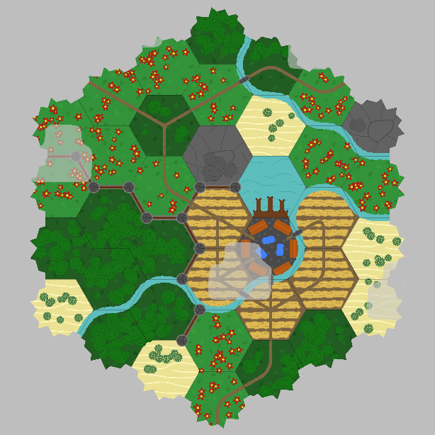
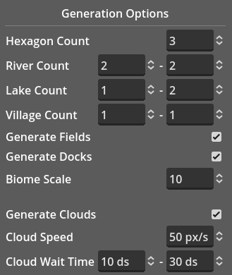

## Godot Hexagon World Generator

A small hobby project to generate procedural hexagon worlds. Generate infinite configurations and configure parameters such as tile count, river cound and biome scale. Edit your world by changing terrain types, placing paths and walls to add extra detail.

You can either run the pre-built Windows binary or open the project in [Godot Engine](readme/https://godotengine.org) yourself.
